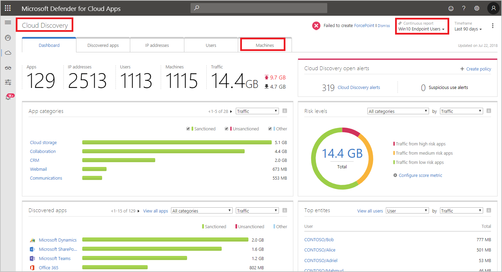

---
# required metadata

title: Integrate Windows Defender ATP with Cloud App Security
description: This article describes how to integrate Windows Defender Advanced Threat Protection with Cloud App Security for enhanced visibility into Shadow IT and risk management.
keywords:
author: rkarlin
ms.author: rkarlin
manager: mbaldwin
ms.date: 12/18/2018
ms.topic: conceptual
ms.prod:
ms.service: cloud-app-security
ms.technology:
ms.assetid: b35ca44c-da8e-49ec-89d1-c076d123c14f

# optional metadata

#ROBOTS:
#audience:
#ms.devlang:
ms.reviewer: reutam
ms.suite: ems
#ms.tgt_pltfrm:
ms.custom: seodec18

---
# Windows Defender Advanced Threat Protection integration with Microsoft Cloud App Security

*Applies to: Microsoft Cloud App Security*

Microsoft Cloud App Security integrates with Windows Defender Advanced Threat Protection (ATP) natively. The integration simplifies roll out of Cloud Discovery, extends Cloud Discovery capabilities beyond your corporate network, and enables machine-based investigation. [Windows Defender Advanced Threat Protection (ATP)](https://docs.microsoft.com/windows/security/threat-protection/windows-defender-atp/windows-defender-advanced-threat-protection) is a security platform for intelligent protection, detection, investigation, and response. Windows Defender ATP protects endpoints from cyber threats, detects advanced attacks and data breaches, automates security incidents, and improves security posture.

Microsoft Cloud App Security uses the traffic information collected by Windows Defender ATP about the cloud apps and services being accessed from IT-managed Windows 10 machines. The integration enables you to run Cloud Discovery on any machine in the corporate network, using public wifi, while roaming and over remote access. It also enables machine-based investigation.

After you identify a risky user, you can check all the machines the user accessed to detect potential risks. If you identify a risky machine, check all the users who used it to detect potential risks. Logs from your endpoints routed to Cloud App Security provide user information for traffic activities. Windows Defender ATP network activity provides device context. Pair device context with the username to provide a full picture across your network of which user did which activity from which machine.

Microsoft Cloud App Security uses the native integration with Windows Defender ATP to tap into data about cloud app and service traffic from managed Windows devices. The integration doesn't require any additional deployment and works out of the box. You don't need to route or mirror traffic from your endpoints or do complex integration steps.

> [!NOTE]
> Want to experience Windows Defender ATP? [Sign up for a free trial](https://www.microsoft.com/WindowsForBusiness/windows-atp?ocid=docs-wdatp-assignaccess-abovefoldlink).
>

## Prerequisites

- Microsoft Cloud App Security license
- Windows Defender ATP license
- Windows 10 machines running version 1809 or later

## How it works

On its own, Cloud App Security collects logs from your endpoints using either [logs you upload](create-snapshot-cloud-discovery-reports.md) or by [configuring automatic log upload](discovery-docker.md). Native integration enables you to take advantage of the logs Windows Defender ATP's agent creates when it runs on Windows and monitors network transactions. Use this information for Shadow IT discovery across the Windows machines on your network.

To enable you to perform Cloud Discovery across other platforms, it's best to use both the Cloud App Security [log collector](discovery-docker.md), along with Windows Defender ATP integration to monitor your Windows 10 machines.

## How to integrate Windows Defender ATP with Cloud App Security

To enable integration with Cloud App Security from Windows Defender ATP:

1. In the Windows Defender ATP portal, from the navigation pane, select **Preferences setup**.
2. In the **Settings** menu, under **General**, select **Advanced features**.
3. Toggle the **Microsoft Cloud App Security** to **On**.
4. Click **Save preferences**.

>[!NOTE]
> It takes up to two hours after you enable the integration for the data to show up in Cloud App Security.
>

   

## Investigate machines in Cloud App Security

After you integrate Windows Defender ATP with Cloud App Security, you can investigate discovered machine data in the Cloud Discovery dashboard.

1. In the Cloud App Security portal, click **Cloud Discovery** and then **Cloud Discovery dashboard**.
2. In the top navigation bar, under **Continuous reports**, select **Win10 endpoint users**.
  
3. Across the top, you'll see the number of discovered machines added after the integration.
4. Click the **Machines** tab.
5. You can drill down into each machine that's listed, and use the tabs to view the investigation data. Find correlations between the machines, the users, IP addresses, and apps that were involved in incidents:
   - **Overview**
      - Transactions: Information about the number of transactions that took place on the machine over the selected period of time.
      - Total traffic: Information about the total amount of traffic (in MB) over the selected period of time.
     - Uploads: Information about the total amount of traffic (in MB) uploaded by the machine over the selected period of time.
     - Downloads: Information about the total amount of traffic (in MB) downloaded by the machine over the selected period of time.
   - **Discovered apps** 
  Lists all the discovered apps that were accessed by the machine.
   - **User history** 
    Lists all the users who signed in to the machine.
   - **IP address history** 
    Lists all the IP addresses that were assigned to the machine.
 
 
As with any other Cloud Discovery source, you can export the data from the Win10 endpoint users report for further investigation. 

## Related Videos

[Shadow IT discovery beyond the corporate network with Windows Defender ATP and Cloud App Security](https://www.youtube.com/watch?v=f8hbvbY1Hnc)  

## Next steps 
[Control cloud apps with policies](control-cloud-apps-with-policies.md) 

[Premier customers can also create a new support request directly in the Premier Portal.](https://premier.microsoft.com/)  
  
