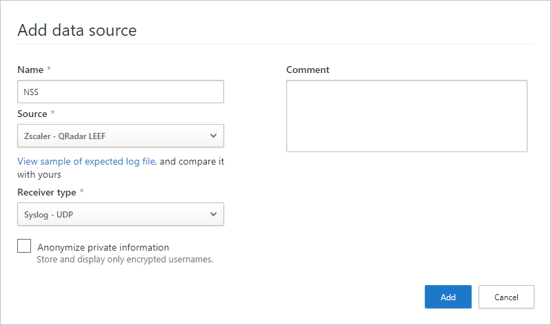

---
# required metadata

title: Integrate Cloud App Security with Zscaler for seamless cloud discovery and automated block sanctioned apps | Microsoft Docs
description: Integrate Cloud App Security with Zscaler for seamless Cloud Discovery and automated block of sanctioned apps.
keywords:
author: rkarlin
ms.author: rkarlin
manager: mbaldwin
ms.date: 8/28/2018
ms.topic: article
ms.prod:
ms.service: cloud-app-security
ms.technology:
ms.assetid: 8abeab8e-3b7a-46a7-bbec-9aaf26f778a8

# optional metadata

#ROBOTS:
#audience:
#ms.devlang:
ms.reviewer: reutam
ms.suite: ems
#ms.tgt_pltfrm:
#ms.custom:

---
*Applies to: Microsoft Cloud App Security*

# Integrate Cloud App Security with Zscaler

If you work with both Cloud App Security and Zscaler, you can integrate the two products to enhance your security Cloud Discovery experience. Zscaler, as a standalone cloud proxy, monitors your organization's traffic enabling you to set policies for blocking transactions. Together, Cloud App Security and Zscaler provide the following capabilities:

- Seamless deployment of Cloud Discovery - Using Zscaler to proxy your traffic and send it to Cloud App Security eliminates the need for installing log collectors on your network endpoints to enable Cloud Discovery.
- Zscaler's block capabilities are automatically applied on apps you set as unsanctioned in Cloud App Security.
- Enhance your Zscaler portal with Cloud App Security's risk assessment for 200 leading cloud apps which can be viewed directly in the Zscaler portal.
	

## Prerequisites

- A valid license for Microsoft Cloud App Security
- A valid license for Zscaler Cloud 5.6
- An active Zscaler NSS subscription 

## Deployment

1. In the Zscaler portal, perform the necessary steps to complete the [Zscaler partner integration with Microsoft Cloud App Security](https://help.zscaler.com/zia/configuring-mcas-integration).
2. In the Cloud App Security portal, perform the following integration steps:
    1. Click on the settings cog and select **Cloud Discovery Settings**. 
    2. Click on the **Automatic log upload** tab and then click **Add data source**.
	3. In the **Add data source** page, enter the following settings:
		- Name = NSS
		- Source = Zscaler QRadar LEEF
		- Receiver type = Syslog - UDP

	      

	4. Click **View sample of expected log file**. Then click **Download sample log** to view a sample discovery log, and make sure it matches your logs. 
    
3. Investigate cloud apps discovered on your network, see [Working with Cloud Discovery](working-with-cloud-discovery-data.md) for more information and investigation steps.
 
4. Any app that you set as unsanctioned in Cloud App Security will be pinged by Zscaler every two hours, and then automatically blocked by Zscaler. For more information about unsanctioning apps, see [Sanctioning/unsanctioning an app](governance-discovery.md#govern-discovered-apps).
	
	
	
	
	

 
## See Also  
[Control cloud apps with policies](control-cloud-apps-with-policies.md)   

[Premier customers can also choose Cloud App Security directly from the Premier Portal.](https://premier.microsoft.com/)  
  
  